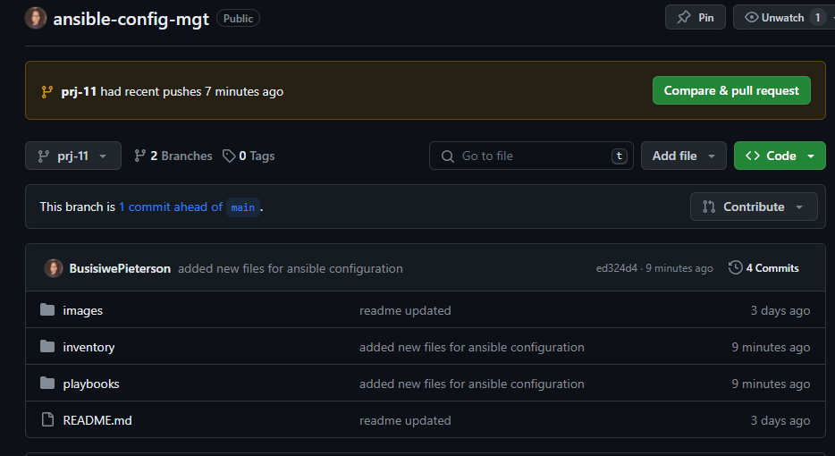

# Ansible Configuration 

*project architecture*


In this project, we will be automating routine tasks with Ansible Configuration Management. In the previous project https://github.com/BusisiwePieterson/NFS-Website-Solution there was a lot of manual operations to set up virtual servers, install and configure required software, and deploy the web application. 

In this project, we get to appreciate DevOps tools by making use of Ansible for automating the configuration of our servers. We will be making use of Ansible-Client as a Bastion Host and will be writing Ansible playbooks, which are an organized set of scripts written in YAML. The scripts define the tasks involved in managing a system configuration using the automation tool Ansible.

But first...

### What is a Bastion Host?

A bastion host is a server used to manage access to an internal or private network from an external network - sometimes called a jump box or jump server. Because bastion hosts often sit on the Internet, they typically run a minimum amount of services to reduce their attack surface. They are also commonly used to proxy and log communications, such as SSH sessions.


## Install and configure ansible on EC2

- Launch a new EC2 instance, this will be used to run playbooks.

- Install Ansible `sudo apt update` then `sudo apt install ansible`

- Check the Ansible version `ansible --version`

- Create a new GitHub repository.


In this step, we create a new Freestyle project in Jenkins and configure a build job to archive the repository content to `ls /var/lib/jenkins/jobs/ansible/builds/<build_number>/archive/
` every time it is changed.


- We configure a new project `ansible-config` and configure a Post-build job to save all `(**)` files.

- Configure a Webhook in GitHub and set the Webhook to trigger our `ansible-config` build.


- Run `ls /var/lib/jenkins/jobs/ansible/builds/<build_number>/archive/
` the setup should look like this, we should see our first Job from the previous project, and the new Job.


- We allocate an Elastic IP so on the Jenkins-Ansible server so that each time we stop/start the server, we do not have to reconfigure GitHub webhook to a new IP address.


## Begin with ansible development

- Clone the GitHub repo that you created to your server `git clone <ansible-config-mgt repo link>
`


- In the project repo create a new branch `git checkout -b <branch-name>`


- Create all the directories and files that are needed for the project


- Add this to the config file, 


### Set up Ansible Inventory

- We use **ssh-agent** to ssh into target servers from our Jenkins-Ansible host. This will help us in getting access to our target servers. 

- To start the agent run :
```
eval `ssh-agent -s`
ssh-add <path-to-private-key>

```

- Run `ssh-add -l` to confirm that the key has been added

- Next, ssh into the Jenkins-Ansible client server using ssh-agent `ssh -A ubuntu@public-ip`


- Test that you can reach one of your servers from Jenkins-Ansible client. `ssh username@private-ip-of-server`


- Update the `inventory.yaml` file 
```
[nfs]
<NFS-Server-Private-IP-Address> ansible_ssh_user=ec2-user

[webservers]
<Web-Server1-Private-IP-Address> ansible_ssh_user=ec2-user
<Web-Server2-Private-IP-Address> ansible_ssh_user=ec2-user

[db]
<Database-Private-IP-Address> ansible_ssh_user=ec2-user 

[lb]
<Load-Balancer-Private-IP-Address> ansible_ssh_user=ubuntu

```


- Create a playbook, write configuration for repeatable, re-usable, and tasks that are common to systems within the infrastructure.


- Commit your code into GitHub:





- Create a Pull request


- Once your code changes appear in `main` branch - Jenkins will do its job ans save all files(build artifacts) to `ls /var/lib/jenkins/jobs/ansible/builds/<build_number>/archive/` directory on `Jenkins-Anaisble` server.


- Update GIT with the latest code


- `cd` into the project folder and run the ansible playbook 

```
cd ansible-config-mgt

ansible-playbook -i inventory/dev.yml playbooks/common.yml

```


- Go to each of the servers and check if wireshrk was installed by running `wireshark --version` on each server


# THE END !


